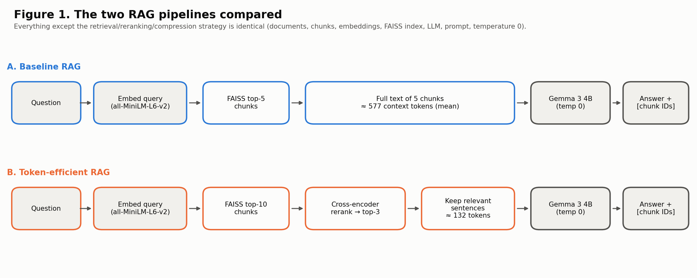
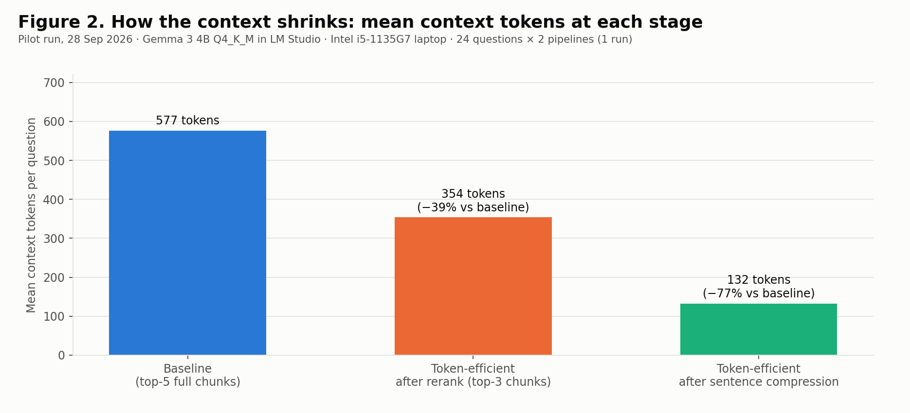
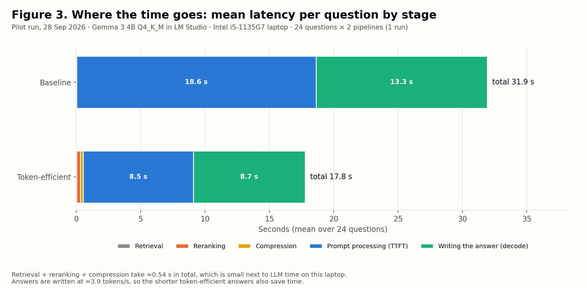
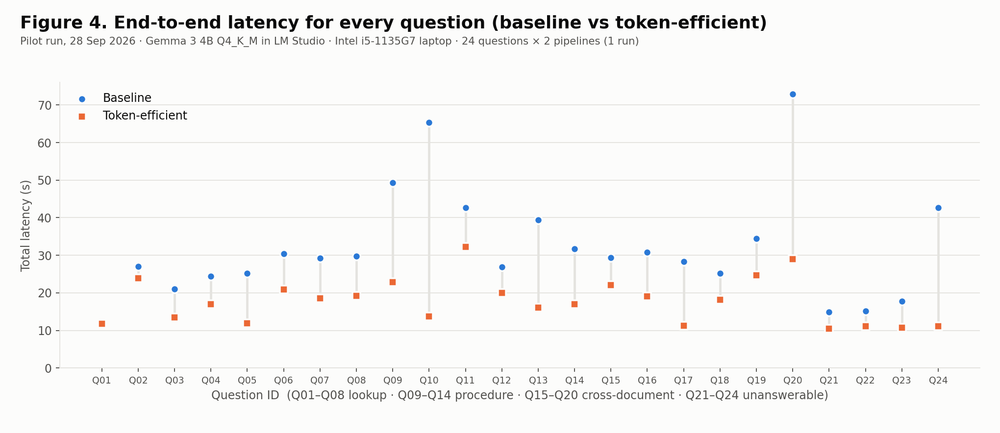
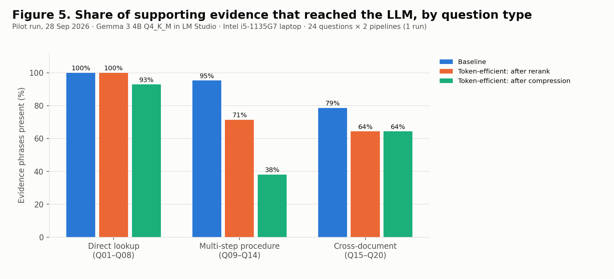
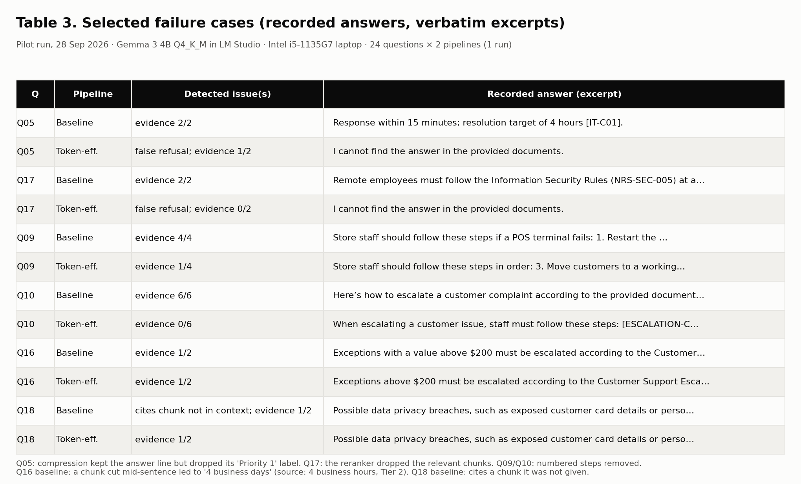

# Token-Efficient RAG

**Reducing context size and latency through reranking and contextual compression in a local RAG system**

> **Research question:** To what extent can reranking and extractive contextual compression reduce context-token usage and response latency in a local RAG system while maintaining answer quality?

In a single pilot run of 24 questions, adding cross-encoder reranking and extractive sentence compression made these changes on a laptop running Gemma 3 4B locally:

- the context sent to the LLM fell by **77%** (577 → 132 tokens);
- mean end-to-end latency fell by **44%** (31.9 s → 17.8 s), and every question was answered faster;
- the extra steps cost about 0.5 s per question;
- the token-efficient pipeline also wrongly refused 2 of 20 answerable questions (the baseline refused none) and gave incomplete answers to step-by-step questions.

**Answer quality has not yet been scored manually**, so the "while maintaining answer quality" part of the question remains open.

---

## Contents

1. [The experiment in brief](#1-the-experiment-in-brief)
2. [Hypotheses](#2-hypotheses)
3. [Methodology](#3-methodology)
4. [Results](#4-results)
5. [Failure cases](#5-failure-cases)
6. [Conclusion](#6-conclusion)
7. [Limitations](#7-limitations)
8. [Repository structure](#8-repository-structure)
9. [How to reproduce](#9-how-to-reproduce)
10. [References](#10-references)

---

## 1. The experiment in brief

Retrieval-augmented generation (RAG) answers questions using passages retrieved from a document collection. Passing whole retrieved chunks to the model makes prompts long, and on a small model running on a laptop, every extra prompt token costs time.

This project compares two RAG pipelines. Everything is the same except how the context is chosen:

| | **A. Baseline RAG** | **B. Token-efficient RAG** |
|---|---|---|
| Retrieval | FAISS top-5 chunks | FAISS top-10 chunks |
| Reranking | none | cross-encoder `ms-marco-MiniLM-L-6-v2` → top-3 |
| Context sent to LLM | full text of the 5 chunks | only relevant original sentences from the 3 chunks (≤ 700 tokens) |
| Shared by both | documents, chunks, embeddings, FAISS index, LLM, system prompt, temperature 0 | |



---

## 2. Hypotheses

| # | Hypothesis | Pilot-run outcome |
|---|---|---|
| H1 | The token-efficient pipeline sends fewer context and prompt tokens. | **Supported:** context −77.0%, prompt −67.2% |
| H2 | End-to-end latency is lower despite the extra reranking and compression step. | **Supported:** −44.3%, faster on 24 / 24 questions |
| H3 | Answer quality is maintained. | **Not established:** manual scoring pending; the automated checks show losses (Section 4.3) |

---

## 3. Methodology

### 3.1 Dataset
- **Corpus:** 6 original, internally consistent policy documents for a fictional company, *Northstar Retail Systems*. They cover leave, IT support, product returns, customer escalation, information security, and remote work.
- **Chunking:** 500 characters with an 80-character overlap, cut at word boundaries, giving **45 chunks**. Each chunk keeps its document ID, chunk ID and character offsets.
- **Questions:** 24 in total: 8 direct lookups, 6 multi-step procedures, 6 cross-document questions and 4 intentionally unanswerable questions. The expected answer to an unanswerable question is exactly *"I cannot find the answer in the provided documents."* Reference answers were written before any run.

### 3.2 Configuration

| Component | Setting |
|---|---|
| LLM | Gemma 3 4B Instruct, Q4_K_M GGUF (`Aldaris/gemma-3-4b-it-Q4_K_M-GGUF`), served by LM Studio's OpenAI-compatible API |
| Generation | temperature 0, top_p 1.0, max_tokens 512, seed 42, streaming |
| System prompt (both pipelines) | "Answer only from the provided context. Do not use outside knowledge. If the answer is not contained in the context, say exactly: 'I cannot find the answer in the provided documents.' Cite the relevant source chunk IDs in square brackets at the end of each answer." |
| Embeddings | `sentence-transformers/all-MiniLM-L6-v2` (384-d, L2-normalised, CPU) |
| Vector index | FAISS `IndexFlatIP` (exact cosine search), one index shared by both pipelines |
| Reranker | `cross-encoder/ms-marco-MiniLM-L-6-v2` (CPU) |
| Compression | Split the top-3 chunks into sentences, remove duplicates caused by chunk overlap, score each sentence with the cross-encoder, then keep sentences with logit ≥ 0 (at least 5, at most 700 tokens) **verbatim**, in reading order, under their chunk ID. Settings were fixed before any run and not tuned. |
| Token counting | Prompt and output tokens come from LM Studio's usage report; context tokens are counted with the Gemma-3 tokenizer (tiktoken cannot tokenize Gemma). The local and server counts matched exactly in all 48 runs. |
| Timing | `time.perf_counter()` for retrieval, reranking, compression, time to first token, generation and end-to-end latency |
| Hardware | Windows laptop, Intel Core i5-1135G7 (4 cores / 8 threads), 19.8 GB RAM, Intel Iris Xe integrated graphics |

### 3.3 Procedure
1. A preflight check confirmed the LM Studio model ID and the tokenizer, and built the index. A 2-question smoke test then had to pass an automatic gate before the full run.
2. One warm-up question was run through both pipelines first and excluded from the results.
3. The pilot run covered 24 questions × 2 pipelines = **48 pipeline runs, 48 successful, 0 failures, 0 retries**. The order of the pipelines alternated from question to question.
4. All metrics were computed from the recorded CSV. Percentage change = (baseline − token-efficient) / baseline × 100. The paired Wilcoxon signed-rank p-values are exploratory.

---

## 4. Results

*All numbers are measured values from the pilot run on 28 Sep 2026 (`results/pilot_run_2026-09-28/`).*

### 4.1 Token usage

| Metric (mean over 24 questions) | Baseline | Token-efficient | Change | Wilcoxon p |
|---|---:|---:|---:|---:|
| Context tokens sent to LLM | 576.8 | 132.5 | **−77.0%** | 1.8e-05 |
| Context before compression (after rerank) | 576.8 | 353.8 | −38.7% | 1.8e-05 |
| Prompt tokens | 661.6 | 217.2 | **−67.2%** | 1.8e-05 |
| Output tokens | 53.3 | 36.1 | −32.3% | 0.0058 |
| Total tokens | 714.9 | 253.4 | **−64.6%** | 1.8e-05 |

The median context fell from 585 to 130 tokens. The token-efficient pipeline retrieves 10 candidate chunks (mean 1,146 tokens), but that text only goes to the reranker and never reaches the LLM.



### 4.2 Latency

| Metric (mean) | Baseline | Token-efficient | Change | Wilcoxon p |
|---|---:|---:|---:|---:|
| Time to first token (prompt processing) | 18.60 s | 8.55 s | **−54.0%** | 1.2e-07 |
| Decode time (writing the answer) | 13.30 s | 8.67 s | −34.8% | 0.00028 |
| LLM generation time | 31.89 s | 17.22 s | −46.0% | 1.2e-07 |
| **End-to-end latency** | **31.92 s** | **17.76 s** | **−44.3%** | 1.2e-07 |
| Reranking time | — | 0.302 s | added cost | — |
| Compression time | — | 0.217 s | added cost | — |

- The median latency fell from 29.31 s to 17.56 s (−40.1%).
- The token-efficient pipeline was faster on **24 / 24** questions (median saving 10.07 s, range 0.24–51.63 s).
- Retrieval, reranking and compression together added **0.54 s** on average.
- A linear fit gives time to first token ≈ 3.43 s + 23.1 ms per prompt token (R² = 0.37). Decode time ≈ 0.256 s per output token (R² = 0.997), about 3.9 tokens/s on this laptop.





### 4.3 Answer diagnostics (automated checks, **not** quality scores)

| Check | Baseline | Token-efficient |
|---|---:|---:|
| Unanswerable questions refused with the exact sentence | 4 / 4 | 4 / 4 |
| Answerable questions wrongly refused | 0 / 20 | **2 / 20** |
| Answers citing a chunk that was not in their context | **1** | 0 |
| Evidence phrases reaching the LLM | 45 / 49 | 30 / 49 |
| … of which lost at reranking / at compression | — | 7 / 8 |
| Answerable questions with **all** evidence in context | 16 / 20 | **10 / 20** |
| Responses cut off by the token limit | 0 | 0 |

"Evidence phrases" are short verbatim source passages that support each reference answer. Checking whether they reached the model is a retrieval diagnostic, not a measure of answer quality.



Evidence loss is concentrated in **multi-step procedure** questions: 95% of the evidence reached the model with the baseline, but only 38% after compression.

---

## 5. Failure cases

| Question | Pipeline | What happened |
|---|---|---|
| Q05 | Token-efficient | **False refusal.** Compression kept "Response within 15 minutes; resolution target of 4 hours" but dropped the "Priority 1 (Critical)" label it belonged to. |
| Q17 | Token-efficient | **False refusal.** The reranker ranked the relevant chunks 5th and 6th, so they fell outside the top 3; no evidence reached the model. |
| Q09 | Token-efficient | **Incomplete.** All 4 steps were in the top chunk, but compression kept only steps 3 and 4. |
| Q10 | Token-efficient | **Unusable.** Steps 3–6 were in a chunk ranked 5th and steps 1–2 were removed by compression; the answer contained only the introductory sentence. |
| Q19 | Token-efficient | The multi-factor authentication sentence was in the context, but the model answered with the password-reuse rule instead. |
| Q16 | Baseline | A chunk ended mid-phrase at "within 4 business"; the answer said "4 business days" and cited the wrong chunk (the source says 4 business hours). |
| Q18 | Baseline | The answer cited a chunk ID that was not in its context. |



---

## 6. Conclusion

- **Observed:** Reranking plus extractive compression reduced context tokens by 77% and mean end-to-end latency by 44% on a CPU-bound laptop. Every question was answered faster, for about 0.5 s of extra processing.
- **Interpretation:** On local hardware, prompt length is a major driver of latency, so trimming the context pays off. Answers were also shorter, and shorter answers save decode time, so part of the gain comes from answer length rather than context size.
- **Quality:** The automated diagnostics show a cost: 2 wrongly refused answerable questions, and incomplete answers where sentence selection broke numbered steps apart. **H3 is therefore not established.** Manual rubric scoring is required before concluding whether quality was maintained.
- **Next steps:**
  - Manual scoring with the 1–5 rubric.
  - Three repeated runs (already supported by the notebook).
  - Structure-aware compression that keeps list headers and neighbouring steps.
  - A wider rerank window (top-5 instead of top-3).

---

## 7. Limitations

- **Small sample:** one pilot run of 24 questions on one laptop, so the statistics are exploratory.
- **Answer-length confound:** shorter answers also save time, so the effects of answer length and context size cannot be fully separated.
- **Synthetic data:** a small corpus written by the same author as the questions; results may differ on real, larger or noisier documents.
- **Untuned compression settings:** they were fixed in advance, and the 700-token budget was never reached, so the logit ≥ 0 threshold and the "at least 5 sentences" rule set the context size.
- **Loss of structure:** sentence-level selection can separate list items and labels from their meaning, and the cross-encoder was trained on web passages.
- **Environment:** Python 3.9.13 was used. Whether LM Studio used the integrated GPU, and whether it honours the `seed` setting, is unknown.
- **Answer quality:** not yet scored manually.

---

## 8. Repository structure

```
Token_Efficient_RAG.ipynb        complete implementation: pipelines, tests, runner, analysis, charts, report
data/
  documents/                     6 policy documents (fictional company)
  eval_questions.json            24 questions + reference answers
results/
  pilot_run_2026-09-28/          raw results of the pilot run (CSV + JSONL), metadata, run log
figures_pilot_run/               charts and tables used in this README and on the poster
requirements.txt                 Python packages
run_notebook.bat                 optional Windows helper: set up a venv and execute the notebook
```

The notebook contains 12 offline test groups, integration tests with the real models, a smoke-test gate and a final self-check of the results.

---

## 9. How to reproduce

1. Install [LM Studio](https://lmstudio.ai), download `gemma-3-4b-it` (Q4_K_M), and start the local server at `http://localhost:1234/v1`.
2. Install the Python packages: `pip install -r requirements.txt`.
3. Open `Token_Efficient_RAG.ipynb`, set `RUN_MODE` in the first code cell, and choose **Restart & Run All**:
   - `"full"`: preflight, tests, smoke test, 3 full passes (144 LLM calls), analysis and report;
   - `"analyze_existing"`: no LLM calls; recomputes metrics, charts and the report from existing results.
4. On Windows you can instead double-click `run_notebook.bat` and choose the mode.

The notebook also runs in **Google Colab**. There it serves the same GGUF model file with llama.cpp on the Colab GPU, so latency is not comparable with laptop results.

---

## 10. References

1. Lewis, P., et al. (2020). Retrieval-Augmented Generation for Knowledge-Intensive NLP Tasks. *NeurIPS*. [arXiv:2005.11401](https://arxiv.org/abs/2005.11401)
2. Reimers, N., & Gurevych, I. (2019). Sentence-BERT. *EMNLP-IJCNLP*. [arXiv:1908.10084](https://arxiv.org/abs/1908.10084)
3. Wang, W., et al. (2020). MiniLM: Deep Self-Attention Distillation. *NeurIPS*. [arXiv:2002.10957](https://arxiv.org/abs/2002.10957)
4. Johnson, J., Douze, M., & Jégou, H. (2019). Billion-scale similarity search with GPUs. *IEEE Transactions on Big Data*. [arXiv:1702.08734](https://arxiv.org/abs/1702.08734)
5. Nogueira, R., & Cho, K. (2019). Passage Re-ranking with BERT. [arXiv:1901.04085](https://arxiv.org/abs/1901.04085)
6. Nguyen, T., et al. (2016). MS MARCO: A Human Generated MAchine Reading COmprehension Dataset. [arXiv:1611.09268](https://arxiv.org/abs/1611.09268)
7. Xu, F., Shi, W., & Choi, E. (2024). RECOMP: Improving Retrieval-Augmented LMs with Context Compression and Selective Augmentation. *ICLR*. [arXiv:2310.04408](https://arxiv.org/abs/2310.04408)
8. Jiang, H., et al. (2023). LLMLingua: Compressing Prompts for Accelerated Inference of Large Language Models. *EMNLP*. [ACL Anthology](https://aclanthology.org/2023.emnlp-main.825)
9. Liu, N. F., et al. (2024). Lost in the Middle: How Language Models Use Long Contexts. *TACL*. [arXiv:2307.03172](https://arxiv.org/abs/2307.03172)
10. Gemma Team, Google DeepMind (2025). Gemma 3 Technical Report. [arXiv:2503.19786](https://arxiv.org/abs/2503.19786)
11. Wilcoxon, F. (1945). Individual Comparisons by Ranking Methods. *Biometrics Bulletin*, 1(6), 80–83.

**Software:** [LM Studio](https://lmstudio.ai) · [sentence-transformers](https://www.sbert.net) · [FAISS](https://github.com/facebookresearch/faiss) · [Hugging Face Transformers](https://github.com/huggingface/transformers) · [llama.cpp](https://github.com/ggml-org/llama.cpp)

---

**Contact:** s4sipraj@uni-trier.de · s4mnagar@uni-trier.de

*All reported numbers come from executed runs; none are estimated. Failed runs are kept in the raw results. Answer-quality scores are not generated automatically.*
